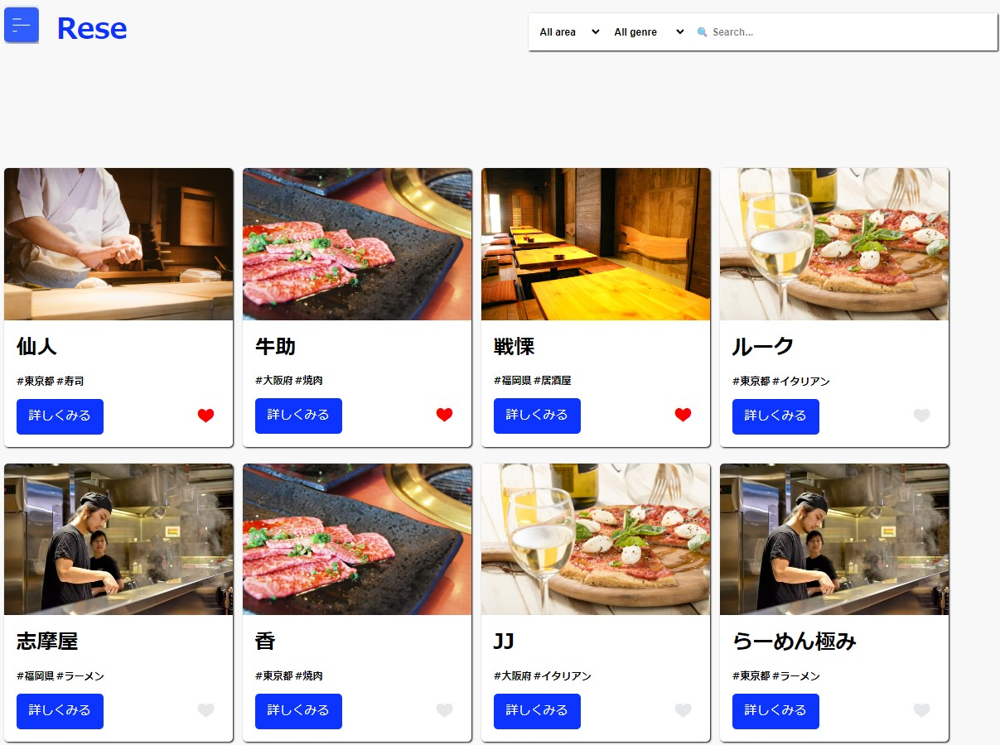
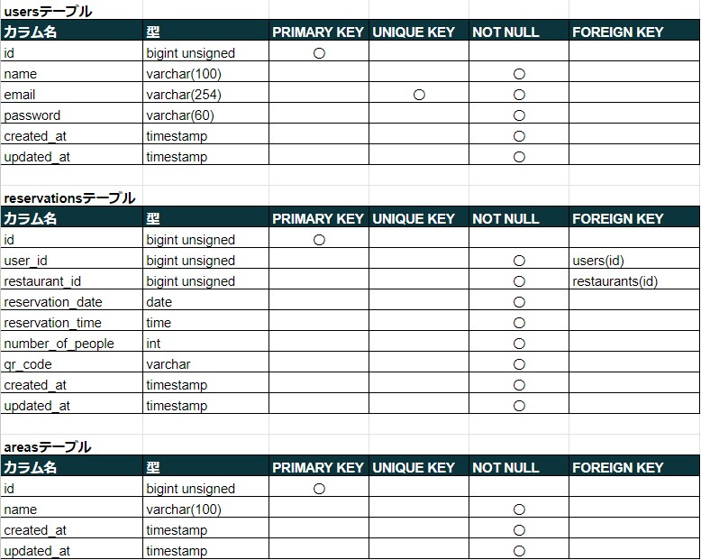
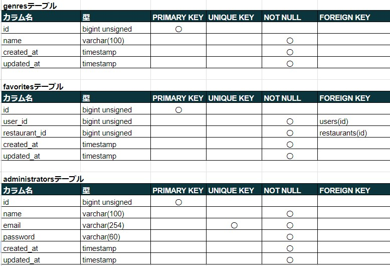
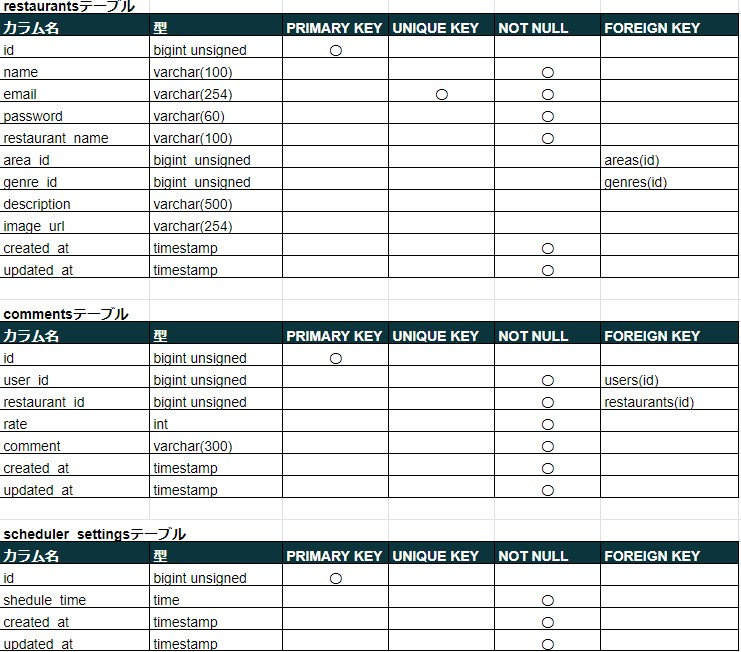
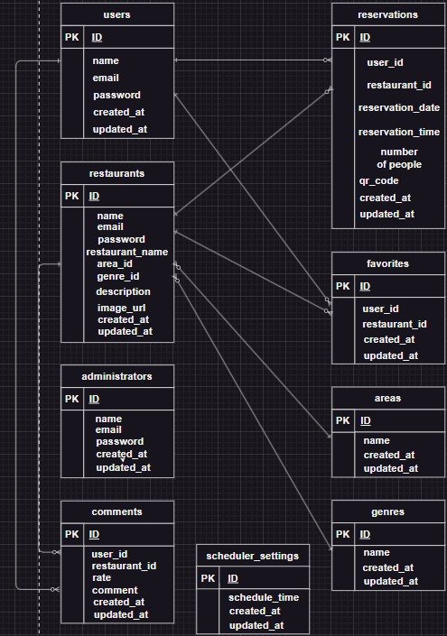

# コーチテックPro入会テスト

・デザインについて一部異なる部分があります。特に、詳細画面の口コミ機能のデザインは上級模擬案件の追加実装で行った評価機能があるため、デザインが異なります。
・口コミ機能の新規追加で、一般ユーザーが1店舗の対して、2件以上の口コミが追加できないよう、口コミが投稿されたらその店舗の口コミを追加するボタンを表示させないようにしています。
・管理ユーザーが口コミを削除するためには、左上のメニューボタンの「管理者はこちら」をクリックし、下の「アカウントの種類（テストユーザー）」の管理者の情報を入力して該当ページに進んで下さい。
・口コミ機能のレスポンシブ対応は、ブレークポイントを375pxに設定しています。

# csvファイルの記述方法（記入例）
name,email,password,restaurant_name,area_id,genre_id,description,image_url 
restaurant21,restaurant@restaurant21.com,restaurant21,一蘭,東京,寿司,美味しい寿司屋です。,storage/sushi.jpg 

※上記2行をcsvファイルにコピーして、csvをインポートしてください。 

これより下は上級模擬案件提出時の内容と同じとなっています。 

# アプリケーション名

飲食店予約サービス（Rese（リーズ）） 

概要説明（どんなアプリか） 
飲食店の予約ができるアプリであり、お気に入り登録をしたり、コメントをしたりすることができる。 

# 作成した目的

概要説明（なんで作成したか） 
とある企業から外部の飲食店予約サービスは手数料が取られるので自社で予約サービスを持ちたいと依頼を受けたため。 

# アプリケーションURL

http://ec2-54-250-237-105.ap-northeast-1.compute.amazonaws.com/ 

新規にユーザー登録し、ログインする時はメール認証が必要になるため、以下URLにアクセスし、メール認証を行ってください。上手くいかない場合は、一番下のテストユーザーを使用してください。 

http://ec2-54-250-237-105.ap-northeast-1.compute.amazonaws.com:8025/ 

上記URLにアクセスしても表示されない場合、私にお申し付けください。 

# 機能一覧

・会員登録 
・ログイン 
・ログアウト 
・ユーザー情報取得 
・ユーザー飲食店お気に入り一覧取得 
・ユーザー飲食店予約情報取得 
・飲食店一覧取得 
・飲食店詳細取得 
・飲食店お気に入り追加 
・飲食店お気に入り削除 
・飲食店予約情報追加 
・飲食店予約情報削除 
・エリア検索 
・ジャンル検索 
・店名検索 
・予約変更 
・評価 
・バリデーション 
・レスポンシブデザイン 
・管理者による店舗代表者情報追加 
・店舗代表者による店舗情報の追加・更新 
・店舗代表者による予約情報取得 
・ストレージ保存 
・メールでの本人確認 
・店舗代表者によるお知らせメール送信 
・予約情報リマインダー 
・QRコード情報取得 
・決済 

## 使用技術（実行環境）

・PHP 7.4.9 
・Laravel 8 
・MySQL 8.0.26 

## テーブル設計

## ER図

# 環境構築

Dockerビルド 
1.git clone リンク 
2.DockerDesktopアプリを立ち上げる 
3.docker-compose up -d --build 

MySQLは、OSによって起動しない場合があるのでそれぞれのPCに合わせてdocker-compose.ymlファイルを編集してください。

Laravel環境構築

1.docker-compose exec php bash 
2.composer install 
3.env.exampleファイルから.envを作成し、環境変数を変更 
4.php artisan key:generate 
5.php artisan migrate 
6.php artisan db:seed 
+αphp artisan storage:link（※必要に応じてコマンドを打ってください。） 

## URL

開発環境:http://localhost/ 
phpMyAdmin:http://localhost:8080/ 
MailHog:http://localhost:8025/ 

管理者ログイン画面：http://localhost/login/admin 
店舗代表者ログイン画面：http://localhost/login/owner 

## アカウントの種類（テストユーザー）

利用者 

メールアドレス：test@example1.com 
パスワード：testtesttest 

店舗代表者 

メールアドレス：restaurant@restaurant1.com 
パスワード：restaurant1 
※店舗代表者のテストアカウントはなるべく使わず、管理者による管理画面から店舗代表者アカウント作成して使用してください。 

管理者 

メールアドレス：admin@admin1.com 
パスワード：admin1 

## 注意事項

・storage/public/images、storage/public/qr_codesにある画像は必要に応じて削除してください。 